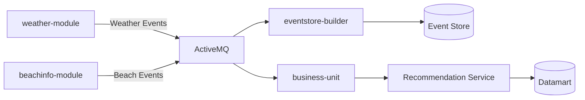
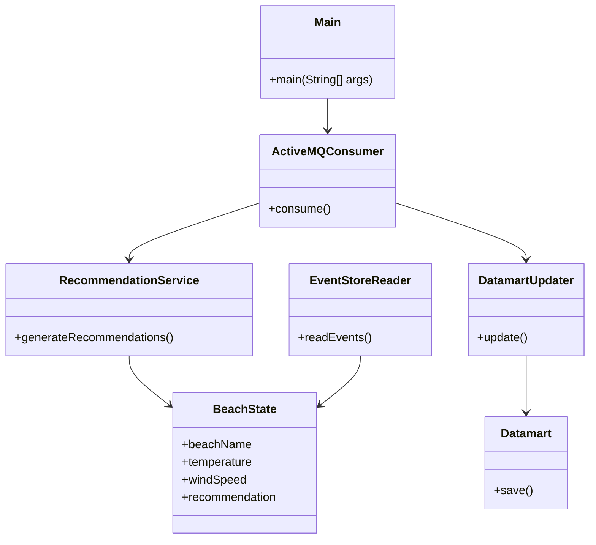
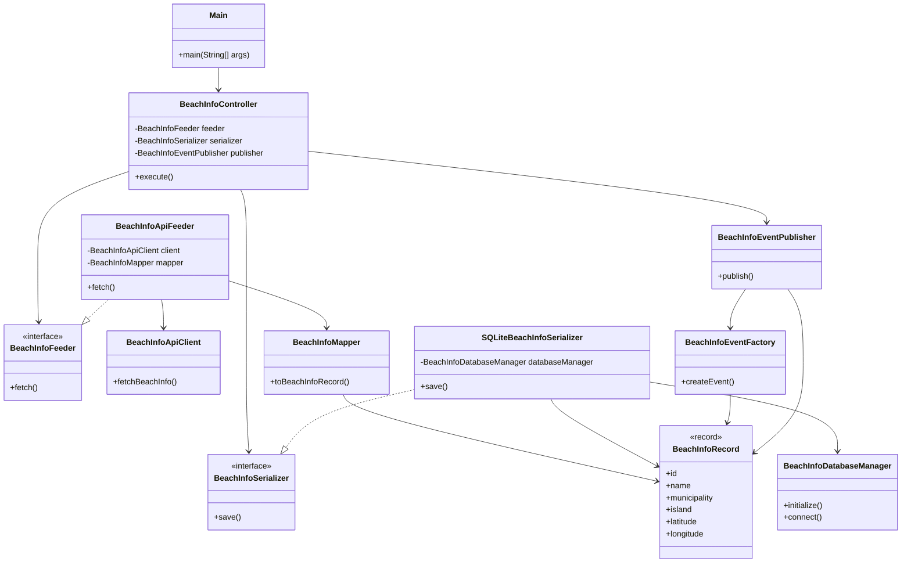

# BeachPlanner

BeachPlanner is an event-driven application that collects beach and weather information from external APIs, processes it through a business unit and generates recommendations for users.

## Overall Architecture

BeachPlanner follows an event-driven modular architecture.

Each ingestion module retrieves information from external APIs and transforms it into domain events. These events are published and later consumed by the business unit, which applies the recommendation logic.

The architecture is composed of:

- Independent ingestion modules
- Event generation and publishing
- Event history persistence
- Business logic processing
- Recommendation generation

## Modules

The project is divided into the following modules:

- `weather-module`  
  Retrieves weather forecasts from Open-Meteo and publishes weather events.

- `beachinfo-module`  
  Retrieves beach metadata from external APIs and publishes beach information events.

- `eventstore-builder`  
  Persists incoming events into the event store for traceability and historical analysis.

- `business-unit`  
  Consumes events and applies the recommendation business logic.

- `common`  
  Contains shared domain structures used across the system.

## EventStore Builder

The `eventstore-builder` module acts as an event persistence and traceability layer within the architecture.

It subscribes to ActiveMQ topics using durable subscribers and stores all incoming events in a structured file-based event store.

Events are organized by:

- Topic
- Source system
- Date

This approach allows:

- Historical event tracking
- System traceability
- Event replay possibilities
- Decoupled persistence from producers and consumers

The module continuously listens for incoming events and persists them asynchronously as they are received.
## Event-Driven Communication

The system uses asynchronous communication through events.

Both `weather-module` and `beachinfo-module` act as event producers. Generated events are published and consumed independently by the business layer, allowing loose coupling between modules.

## Example Application Flow

1. `weather-module` retrieves weather forecasts from Open-Meteo.
2. Forecast data is mapped into `WeatherRecord` objects.
3. Weather events are generated and published through ActiveMQ.
4. `beachinfo-module` retrieves beach metadata from the external API.
5. Beach information events are generated and published.
6. `eventstore-builder` consumes and persists all events.
7. `business-unit` consumes the events asynchronously.
8. Recommendation logic is applied.
9. The datamart is updated with the generated recommendations.

## Technologies

- Java
- Maven
- SQLite
- ActiveMQ
- Gson
- Open-Meteo API
- Event-driven architecture

## Future Improvements

- Real-time recommendation updates
- REST API exposure
- Frontend visualization
- Docker containerization
- Advanced recommendation algorithms
- Cloud deployment

## System Architecture

## Business Unit

The `business-unit` module contains the core business logic of the application.

It consumes events generated by the ingestion modules, updates the internal datamart and generates beach recommendations based on weather and beach conditions.

The module is composed of:

- ActiveMQ consumers
- Event store readers
- Recommendation services
- Datamart update services
- Internal beach state models

## Class Diagram: business-unit

## Common Module

The `common` module contains shared domain structures used across the entire system.

Currently, it provides the `Event` record, which defines the common event structure exchanged between producers, consumers and the event store.

## Class Diagram: weather-module

The following diagram illustrates the internal structure of the weather module:

## Class Diagram: beachInfo module

The beachinfo module is responsible for retrieving beach information from the external API, mapping it into domain records, storing it and publishing beach information events.

## Execution

The application is currently executed manually by launching the modules independently in the following order:

1. Run ActiveMQ.
2. Run the `Main` class from `eventstore-builder`.
3. Run the `Main` class from `business-unit`.
4. Run the `Main` class from `weather-module`.
5. Run the `Main` class from `beachinfo-module`.

The producer modules publish events through ActiveMQ.  
The `eventstore-builder` listens to the topics and stores the received events in the event store.  
The `business-unit` consumes the events asynchronously and updates the datamart with the generated recommendations.