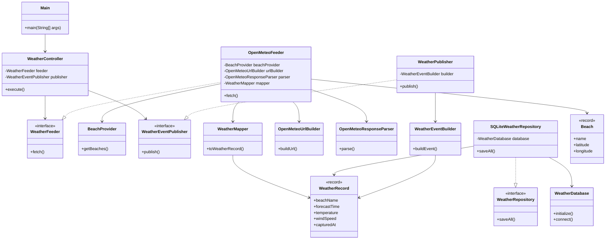

# BeachPlanner

BeachPlanner is an event-driven application that collects beach and weather information from external APIs, processes it through a business unit and generates recommendations for users.

## Class Diagram: weather-module

The following diagram illustrates the internal structure of the weather module:

## Class Diagram beachInfo module

The beachinfo module is responsible for retrieving beach information from the external API, mapping it into domain records, storing it and publishing beach information events.

